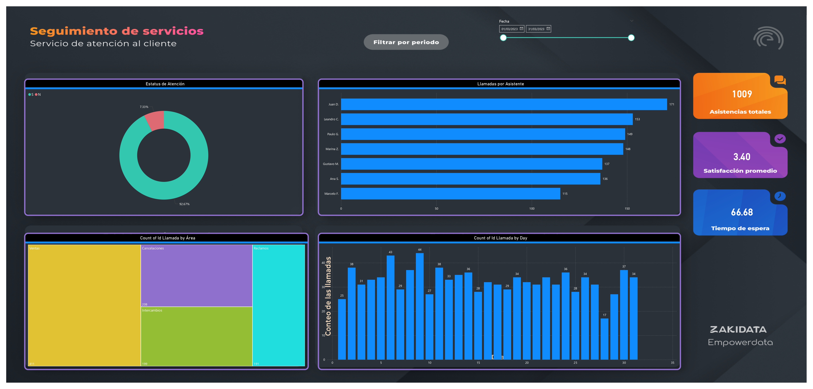

# 📞 Dashboard de Análisis de Servicio – Marzo 2023

Este repositorio contiene un dashboard de **atención al cliente** desarrollado en **Power BI**, con datos correspondientes al mes de **marzo de 2023**.  
El objetivo es evaluar el desempeño de las áreas de servicio, los tiempos de respuesta, la eficiencia en la resolución de llamadas y el nivel de satisfacción de los clientes.

---

## 📂 Contenido del repositorio
- `Dashboard_Servicio.pbix` → archivo de Power BI.  
- `Datos_de _servicio.xlsx` → base de datos utilizada.
- Captura del dashboard.  

---

## 📈 Resumen del servicio
- **Total de llamadas:** 1,009  
- **Satisfacción promedio:** 3.4 / 5  
- **Velocidad de respuesta promedio:** 66.68 segundos  

---

## 🏢 Desempeño por área
| Área              | Llamadas | 
|-------------------|----------|
| Ventas            | 411      | 
| Reclamos          | 191      | 
| Cancelaciones     | 208      |
| Intercambios      | 199      |

---

## 👨‍💼 Desempeño por asistente
| Asistente   | Llamadas | Índice de satisfacción |
|-------------|----------|-------------------------|
| Marcelo F.  | 115      | 3.59 |
| Juan D.     | 171      | 2.82 |
| Ana S.      | 136      | 3.32 |
| Marina Z.   | 148      | 3.60 |
| Leandro C.  | 153      | 3.43 |
| Paulo G.    | 149      | 3.60 |

---

## 📊 Eficiencia y satisfacción
- ✅ **80.3%** de las llamadas fueron **respondidas y resueltas (SÍ - S)**.  
- ⚠️ **15%** fueron **respondidas pero no resueltas (SÍ - N)**.  
- ⛔ **4.7%** no fueron respondidas.  

**Índice de satisfacción promedio general:** 3.24 / 5  

- Llamadas **respondidas y resueltas:** 3.4  
- Llamadas **solo respondidas:** 2.2  

---

## 💡 Insights principales
- El área de **Reclamos** es el punto más crítico: bajo índice de satisfacción (3.12).  
- El área de **Cancelaciones** lidera en satisfacción con 3.37.  
- La efectividad del servicio es alta (**80.3% de resolución**), pero existe oportunidad de mejora en calidad percibida.  
- La carga de llamadas está más concentrada en **Ventas (514)**, por lo que se recomienda equilibrar recursos.  

---

## 🖥️ Vista previa

---

## 🚀 Cómo usar este repositorio
1. Descarga el archivo `.pbix`.  
2. Abre el proyecto en **Power BI Desktop**.  
3. Explora las visualizaciones: desempeño por área, asistente, tiempos de atención y satisfacción.  

---
